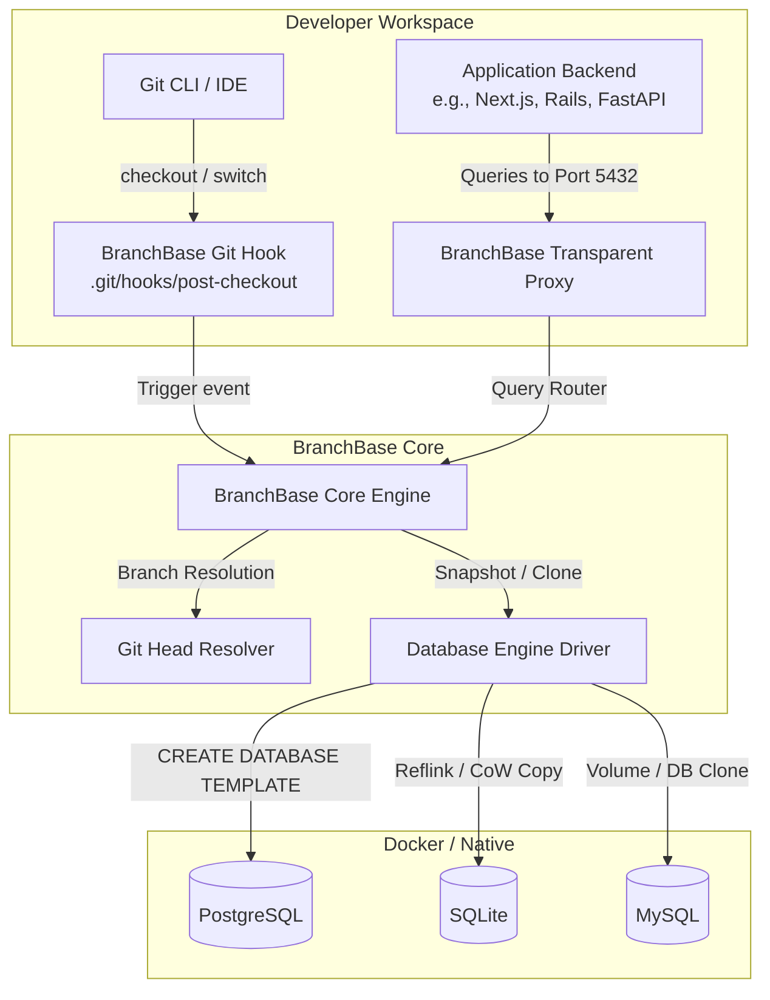

# BranchBase Technical Architecture 🏗️

This document outlines the internal architecture, design principles, and lifecycle flow of **BranchBase**.

---

## 1. High-Level System Architecture

BranchBase sits between the developer's Git workflow, their application code, and the underlying database instance (typically running in Docker or natively).



---

## 2. Core Components

### 2.1 The Git Context Resolver (`internal/git`)
* **Responsibility:** Determines active, local, and merged branches in the repository without invoking uncontrolled subshells.
* **Mechanism:** 
  1. `ResolveCurrentBranch`: Reads `.git/HEAD` (or worktree `gitdir`) directly to resolve active branch in sub-millisecond time.
  2. `ResolveLocalBranches`: Queries `git for-each-ref --format=%(refname:short) refs/heads` with automatic fallback to filesystem inspection of `.git/refs/heads/` and `.git/packed-refs` (retaining full branch awareness post-`git gc`).
  3. `ResolveMergedBranches`: Queries `git branch --merged <defaultBranch>` using explicit argument vectors to identify safe deletion candidates.
  4. Sanitizes branch names for database naming compatibility (`feature/stripe-v2` $\rightarrow$ `feature_stripe_v2`).

### 2.2 The Database Driver Interface (`internal/driver`)
Every supported database implements a standard Go interface:

```go
type Driver interface {
    // Name returns the driver identifier (e.g., "postgres", "sqlite")
    Name() string

    // Ping verifies connectivity to the underlying database engine
    Ping(ctx context.Context) error

    // BranchExists checks if a database for the given branch already exists
    BranchExists(ctx context.Context, branchName string) (bool, error)

    // CreateBranch clones sourceBranch into targetBranch
    CreateBranch(ctx context.Context, sourceBranch, targetBranch string) error

    // DeleteBranch tears down the ephemeral database
    DeleteBranch(ctx context.Context, branchName string) error

    // ListBranches returns all databases managed by BranchBase
    ListBranches(ctx context.Context) ([]BranchInfo, error)

    // Close releases database connections and engine pools
    Close() error
}
```

#### PostgreSQL Implementation:
Postgres natively supports instant database cloning via the `TEMPLATE` directive with `lib/pq` connection management:
```sql
-- Step 1: Disconnect any active connections to template (if needed)
SELECT pg_terminate_backend(pid) FROM pg_stat_activity 
WHERE datname = 'myapp_dev_main' AND pid <> pg_backend_pid();

-- Step 2: Instant copy-on-write clone
CREATE DATABASE "myapp_dev_feature_billing" TEMPLATE "myapp_dev_main";
```
Idempotency is preserved by gracefully handling PostgreSQL SQLSTATE `42P04` (`duplicate_database`).

#### SQLite Implementation:
For SQLite, BranchBase utilizes filesystem-level **Copy-on-Write (CoW)** snapshots with `.db-wal` and `.db-shm` replication:
* **macOS (APFS):** High-throughput cloning.
* **Linux (Btrfs / XFS):** `ioctl(FICLONE)` reflink copying.
* **Windows & Fallback:** Buffered stream copy with full file sync.

---

### 2.3 The Transparent TCP Proxy (`internal/proxy`)
To ensure developers **never have to touch `.env`** or restart their dev servers when switching branches:

1. The proxy listens on the standard port (e.g., `5432` for Postgres).
2. The real database container is remapped to an internal port (e.g., `5433` or a UNIX domain socket).
3. **On-Demand (JIT) Branch Provisioning:**
   - If incoming connection targets an unprovisioned branch, `Server.ensureBranchExists()` provisions the database on the fly from the default branch.
   - Guarded by a refcounted `keyedMutex` using **double-checked locking**: fast-path check avoids locking for existing databases; slow-path lock serializes concurrent incoming connections for the same missing branch.
   - Strict 5-second `context.WithTimeout` prevents connection starvation.
4. **Wire-Protocol Rewriting:**
   - Intercepts PostgreSQL `StartupMessage`, rewrites database parameter to branch database (`myapp_dev_feature_billing`), responds to SSL negotiation, and streams bidirectionally with zero overhead.

---

## 3. The Lifecycle of a Branch Switch

```mermaid
sequenceDiagram
    autonumber
    actor Dev as Developer
    participant Git as Git CLI
    participant Hook as post-checkout Hook
    participant BB as BranchBase Daemon
    participant DB as Postgres Instance
    participant Proxy as BranchBase Proxy

    Dev->>Git: git checkout -b feature/auth
    Git->>Hook: Trigger post-checkout(old_head, new_head, 1)
    Hook->>BB: Notify branch_switch("main", "feature/auth")
    BB->>DB: Check if db_feature_auth exists
    alt Database does not exist
        BB->>DB: CREATE DATABASE db_feature_auth TEMPLATE db_main;
        DB-->>BB: OK (Instant)
    end
    BB->>Proxy: Update active_branch_routing("feature/auth")
    Proxy-->>Dev: Ready!

    Note over Dev,Proxy: App sends query: "SELECT * FROM users;"
    Proxy->>DB: Forwarded to db_feature_auth transparently
```

---

## 4. Branch Cleanup & Pruning

Over time, working on dozens of feature branches can accumulate disk space.

* **Command:** `branchbase prune [--dry-run] [--force]`
* **Algorithm:**
  1. Inspects local and merged Git branches via `git.ResolveMergedBranches()` and `git.ResolveLocalBranches()`.
  2. Identifies all databases matching the pattern `<base_db>_<branch>`, excluding protected base databases and the currently active branch.
  3. If `--dry-run` is provided, previews candidates and freed disk space without deleting.
  4. Prompts interactive confirmation (`[y/N]`) before deletion unless `--force` / `-f` is specified.
  5. Safely deletes ephemeral databases, freeing allocated storage.

---

## 5. Security & Isolation Guarantees

* **Zero Cloud Dependency:** BranchBase runs strictly on `localhost` or via private UNIX domain sockets. No data or telemetry leaves the machine.
* **Non-Destructive:** BranchBase **never** modifies or drops the `base_database` (e.g., `main`). Default branches are marked as protected by default.
* **Ephemeral Workspaces:** Can be integrated into Docker Compose workflows via named volumes.
