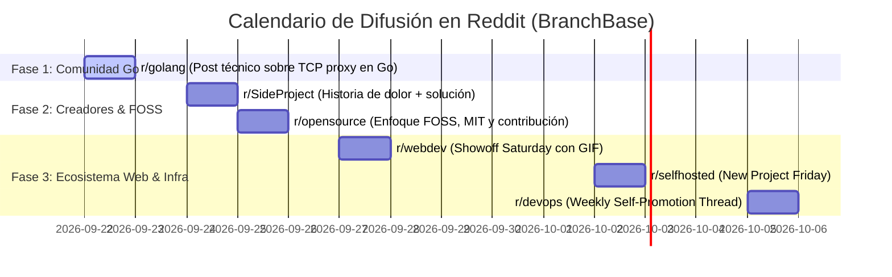

# 🌿 Guía Maestra: Redacción Humana para Desarrolladores y Estrategia de Lanzamiento en Reddit (BranchBase)

---

## 🎯 PARTE 1: Cómo Evitar que una Redacción Parezca Hecha por IA

Los desarrolladores en comunidades como **Hacker News**, **Reddit** (`r/programming`, `r/golang`), **Lobste.rs** y **Twitter/X** tienen el detector de IA más afilado de internet. Reconocen inmediatamente el texto generado porque están acostumbrados a la alta densidad de información (código, RFCs, logs, benchmarks) y repelen el "relleno corporativo".

---

### 1. Los 7 "Pecados Capitales" del Texto de IA

| Patrón de IA (Lo que delata a la IA) | Por qué los devs lo odian | Cómo escribir como un humano real |
| :--- | :--- | :--- |
| **Sobredosis de viñetas (Bullet Points)** | La IA usa listas de 3 a 5 puntos para todo, con negrita inicial y longitud idéntica. | **Escribe en párrafos de prosa.** Usa listas únicamente cuando enumeres comandos o flags concretos. |
| **Vocabulario Cliché ("AI-isms")** | Palabras como *delve, landscape, robust, seamless, empower, supercharge, tapestry, game-changer*. | Usa vocabulario técnico cotidiano y directo: *rompió, tardaba 20 minutos, es un proxy TCP simple, clonación por bloques*. |
| **Cadencia y Ritmo Simétrico** | La IA escribe frases de 18-22 palabras con estructura sujeto-verbo-predicado idéntica. | **Burstiness (variabilidad):** Alterna frases de 3 palabras con explicaciones técnicas complejas. |
| **Cero Cicatrices de Batalla** | La IA habla desde una perspectiva abstracta y neutral ("El branching de base de datos es vital..."). | **Cuenta anécdotas reales:** "El martes pasado me cargué la base de datos de desarrollo por décima vez por una migración de Stripe". |
| **Exceso de Emojis Infantiles** | La IA decora cada título y punto con 🚀, 💡, 🔥, ⚡, 🛠️. | **Elimina el 90% de los emojis.** Un post técnico en Reddit no necesita más de 0 o 1 emoji. |
| **Cierres con Preguntas de Compromiso Falsas** | *"En conclusión, X es el futuro. ¿Qué opinas? ¡Déjame tus comentarios abajo!"* | **Termina abruptamente con un reto técnico:** *"El código es MIT. Si alguien sabe cómo optimizar `FICLONE` en Linux, feedback bienvenido."* |
| **Voz Pasiva y Tono Corporativo** | *"Se ha implementado una arquitectura modular orientada a..."* | **Voz activa y directa:** *"Puse un proxy TCP en el puerto 5433 que intercepta el socket y consulta `git rev-parse`."* |

---

### 2. Lista Negra de Palabras y Frases Prohibidas

Evita terminantemente estas palabras y construcciones en tus posts técnicos:

```text
❌ PALABRAS PROHIBIDAS:
- delve / profundizar
- landscape / panorama actual
- robust / robusto (a menos que hables de tolerancia a fallos matemáticos)
- seamless / sin fisuras / transparente (a menos que te refieras a TCP)
- game-changer / revolucionario
- empower / empoderar
- supercharge / potenciar al máximo
- intricate / intrincado
- testament / testimonio de
- meticulously / meticulosamente
- plethora / sinfín de

❌ FRASES DE RELLENO:
- "En el mundo actual del desarrollo de software..."
- "Es importante destacar que..."
- "Además de lo anterior..."
- "Sin duda alguna..."
- "En resumen / En conclusión..."
```

---

### 3. Comparativa: Redacción "Modo IA" vs. Redacción "Humano Técnico"

#### ❌ Ejemplo Modo IA (Lo que genera rechazo inmediato):
> *BranchBase es una solución innovadora y robusta diseñada para transformar el panorama del desarrollo local. En el mundo del software moderno, lidiar con migraciones rotas es un reto constante. Nuestras características clave incluyen:*
> * 🚀 **Clonación Instantánea:** *Copia tus bases de datos sin esfuerzo.*
> * ⚡ **Proxy Inteligente:** *Enrutamiento dinámico y sin fricción.*
> * 🔒 **Privacidad Total:** *Tus datos permanecen seguros en tu máquina local.*
> *¿Estás listo para llevar tu flujo de trabajo al siguiente nivel? ¡Comparte tus pensamientos!*

#### ✅ Ejemplo Humano Técnico (Alta conversión y respeto comunitario):
> *Estaba harto de ejecutar `docker compose down -v` cada vez que cambiaba de rama en Git y una migración fallaba en PostgreSQL. Perdía 15 minutos en cada cambio de contexto recreando esquemas y cargando seeds.*
>
> *Para resolverlo escribí **BranchBase** en Go. Básicamente levanta un proxy TCP en el puerto 5433 que intercepta las conexiones de tu app, mira qué rama de Git tienes activa (`git rev-parse --abbrev-ref HEAD`) y redirige el socket a una base de datos clonada con `CREATE DATABASE ... TEMPLATE` (en Postgres) o copias CoW (en SQLite).*
>
> *El binario es único, no tiene dependencias pesadas y está bajo licencia MIT:*
> *Repo: https://github.com/oscarbol09/branchbase*
>
> *¿Alguien con experiencia en el protocolo de handshake de MySQL/MariaDB que pueda revisar el parser del proxy?*

---

## 🛡️ PARTE 2: Normas de Reddit y Políticas de Autopromoción

Reddit es una plataforma comunitaria hostil al spam comercial, pero **extremadamente generosa con los desarrolladores que comparten herramientas Open Source útiles y participan con humildad técnica.**

---

### 1. La Regla Global del 90/10 (o 9:1)

* **¿Qué es?**: Por cada **1 post o enlace propio** que compartas, debes tener al menos **9 interacciones orgánicas** (comentarios ayudando a otros, respuestas en hilos existentes, discusiones no promocionales).
* **El Peligro**: Si los algoritmos de Reddit o los moderadores detectan que tu cuenta solo publica enlaces a tus repositorios o webs, serás **shadowbaneado** (tus posts serán invisibles para todos sin que te des cuenta).
* **Acción recomendada**: Antes de publicar BranchBase, comenta en varios hilos de `r/golang`, `r/PostgreSQL`, `r/webdev` respondiendo dudas técnicas reales.

---

### 2. Normas Específicas por Subreddit

| Subreddit | Miembros | Política de Autopromoción | Formato Obligatorio / Recomendado | Nivel de Riesgo |
| :--- | :---: | :--- | :--- | :---: |
| **`r/golang`** | ~250k | ✅ **Permitido:** Siempre que el proyecto esté en Go, no sea comercial cerrado y el post explique la arquitectura interna en Go. | **Post de texto (Self-post).** Detalla cómo usaste `net`, `context`, goroutines y drivers SQL. | 🟢 Bajo |
| **`r/SideProject`** | ~200k | ✅ **Permitido:** Creado específicamente para mostrar proyectos personales y herramientas. | **Post de texto o vídeo/GIF.** Enfoque: problema que resuelve + demo + enlace a GitHub. | 🟢 Muy Bajo |
| **`r/opensource`** | ~150k | ✅ **Permitido:** Foco en FOSS, licencia MIT, privacidad 100% local y cómo colaborar. | **Post de texto.** Menciona que no hay telemetría ni nube y que hay `good first issues`. | 🟢 Muy Bajo |
| **`r/selfhosted`** | ~400k | ⚠️ **Regla "New Project Friday":** Proyectos nuevos deben publicarse preferiblemente los viernes. | **Post de texto.** Explicar que funciona local/offline sin enviar datos a terceros. | 🟡 Medio |
| **`r/devops`** | ~400k | ⚠️ **Hilos Semanales:** Tienen un *"Weekly Self-Promotion Thread"*. Publicar en el feed principal puede ser eliminado. | Publicar en el hilo semanal fijado, o plantearlo como un post de debate sobre "Local staging vs Ephemeral DBs". | 🟡 Medio |
| **`r/webdev`** | ~2.5M | ⚠️ **"Showoff Saturday":** Solo se permite mostrar proyectos personales los **sábados** con el flair `Showoff Saturday`. | Publicar un sábado con demo visual (GIF/vídeo) o explicación técnica enfocada al dolor de Prisma/TypeORM/Rails. | 🟡 Medio |
| **`r/PostgreSQL` / `r/database`** | ~100k | ⚠️ **Muy técnicos y estrictos:** Odian el marketing superficial. Aman debates profundos sobre `TEMPLATE`, `pg_terminate_backend()` y CoW. | Post de discusión técnica preguntando por casos borde en clonación de bases de datos. | 🔴 Alto si es spam / 🟢 Excelente si es técnico |
| **`r/programming`** | ~5.8M | 🚫 **Estricto:** No aceptan posts de "Look what I built" con enlace directo. Se eliminan automáticamente. | Solo se recomienda si escribes un **artículo de ingeniería a fondo** (en tu blog) sobre un reto de bajo nivel. | 🔴 Muy Alto |

---

### 3. Las Reglas de Oro para Publicar en Reddit

1. **Usa SIEMPRE "Text Post" (Self-post), NUNCA "Link Post":**
   * Un *Link post* (que va directo a GitHub) parece spam automático y los moderadores lo borran en minutos.
   * Un *Text post* te permite contar la historia técnica, poner fragmentos de código/terminal y poner el enlace al final de forma natural.
2. **No hagas "Launch Blast" (No publiques en 5 subs el mismo día):**
   * Publicar el mismo texto en 5 subreddits en 30 minutos activa los filtros automáticos de spam de Reddit.
   * **Estrategia escalonada:** Publica en `r/golang` el martes, en `r/SideProject` el jueves, en `r/webdev` el sábado, etc.
3. **Regla de las Primeras 2 Horas:**
   * Cuando publiques, quédate pegado a la pantalla durante al menos 90 minutos.
   * Responde **cada uno de los comentarios** con rapidez, humildad y detalle técnico. El algoritmo de Reddit premia los posts con alta tasa de respuesta en los comentarios tempranos.
4. **Cero Voto Manipulado (Brigading):**
   * Nunca pases el enlace por WhatsApp, Discord o Twitter diciendo *"por favor denle upvote a mi post de Reddit"*. Si Reddit detecta que 10 cuentas entran directamente al link sin navegar orgánicamente, penaliza el post a 0 upvotes.

---

## 📅 Plan Táctico de Publicación Escalonada para BranchBase



---

## 📝 Plantillas Listas para Usar (Redacción 100% Humana)

### 📌 Plantilla 1: Para `r/golang` (Martes)
**Título:** *I built a local database branching tool in Go that switches DBs on git checkout*

**Cuerpo:**
```markdown
Hey everyone,

Like many of you, I work on multiple Git branches daily with local PostgreSQL and SQLite. Every time I had to jump from `feature/new-billing` back to `main` to hotfix a bug, I ran into pending migration crashes (`ActiveRecord::PendingMigrationError` / Prisma column mismatch). My previous fix was the brute-force `docker compose down -v && docker compose up`, which wasted 10-15 minutes every time.

I wrote **BranchBase** to automate this locally using Go's standard library.

### How it works under the hood:
1. **TCP Proxy (`internal/proxy`):** It runs a lightweight proxy on port 5433. When your ORM connects, it checks the current Git branch via `git rev-parse --abbrev-ref HEAD`.
2. **Template Cloning (`internal/driver/postgres`):** It intercepts the connection and clones the base DB using `CREATE DATABASE ... TEMPLATE` after terminating active idle connections with `pg_terminate_backend()`.
3. **SQLite Support (`internal/driver/sqlite`):** On Linux/macOS, it uses copy-on-write syscalls (`FICLONE` / `clonefile`) for instant disk snapshots.

### Tech Stack:
- Go 1.22+ (zero third-party web frameworks, standard `net`, `io`, `database/sql`)
- Wire protocol sniffer for PostgreSQL & MySQL startup packets.
- MIT Licensed.

Repo: https://github.com/oscarbol09/branchbase

I would love feedback from the community, especially regarding the MySQL wire protocol handshake parser in `internal/proxy/mysql.go` if anyone has deep protocol experience.
```

---

### 📌 Plantilla 2: Para `r/webdev` (Showoff Saturday)
**Título:** *[Showoff Saturday] I got tired of dropping my local database on every git checkout, so I built an open-source CLI*

**Cuerpo:**
```markdown
Hey webdevs,

Quick question: how many times this week have you seen:
`column "user_id" does not exist` or `ActiveRecord::PendingMigrationError` right after switching git branches?

I got fed up with running `prisma migrate reset` or wiping Docker volumes during context switches, so I built **BranchBase**.

### What it does:
You point your `.env` `DATABASE_URL` to `localhost:5433` (BranchBase proxy) instead of `5432`.
- When you are on `git checkout feature/auth`, you read/write to `mydb_feature_auth`.
- When you `git checkout main`, your connection transparently routes back to `mydb_main`.
- When you delete or merge a branch, running `branchbase prune` wipes orphan databases.

It's 100% local, runs as a single binary, supports PostgreSQL, MySQL, and SQLite, and is open source (MIT).

- GitHub: https://github.com/oscarbol09/branchbase
- Docs: https://oscarbol09.github.io/branchbase/

Happy to answer any questions or hear about your current local DB setups!
```

---

### 📌 Plantilla 3: Para `r/SideProject`
**Título:** *I built BranchBase: Git-like database branching for your local dev environment (Open Source)*

**Cuerpo:**
```markdown
Hey r/SideProject,

I wanted to share a developer tool I've been building: **BranchBase**.

### The Problem:
Switching Git branches while testing schema changes (migrations, rollbacks, seed data) usually breaks your local database. You either have to manually run down-migrations (which nobody writes cleanly anymore) or wipe the database and re-seed from scratch.

### The Solution:
BranchBase is a zero-config CLI that mirrors your Git branches into isolated database copies in milliseconds. It intercepts your local DB connections via a lightweight proxy and routes your app to the correct branch database automatically.

- **Stack:** Go standard library + SQLite/Postgres/MySQL drivers.
- **Privacy:** 100% offline, zero cloud telemetry, MIT license.
- **Terminal UI:** Includes a built-in TUI (`branchbase tui`) to inspect active branch databases and storage usage.

Check it out on GitHub: https://github.com/oscarbol09/branchbase

Feedback, bug reports, and feature ideas are very welcome!
```
